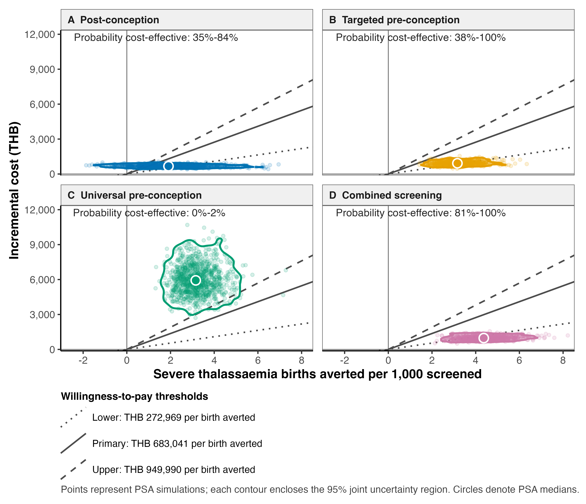

# Economic model of thalassaemia screening strategies in Thailand

This repository contains an economic decision tree model evaluating four
thalassaemia screening strategies in Thailand against **no screening**:

1. Postconception screening
2. Preconception screening using CBC and Hb typing with targeted DNA analysis
3. Preconception screening using universal DNA analysis
4. Combined preconception and postconception screening

The primary outcome is the incremental screening cost in Thai Baht (THB) per
severe thalassaemia birth averted. The analysis also reports benefit-cost
ratios and net cost savings under three hospital care scenarios. Budget impact
and carrier prevalence threshold analyses are also provided.

## Analytical perspective and assumptions

- **Perspective:** Healthcare payer; only direct medical costs are included.
- **Comparator:** No screening.
- **Price year for screening costs:** 2025 THB.
- **Price year for management costs:** 2024 THB, treated as comparable with 2025 THB
  because a 2025 Thai GDP deflator was unavailable.
- **Life expectancy:** 30 years for patients with severe thalassaemia.
- **Discount rate:** 3% annually for future management costs.
- **Individual carrier prevalence:** 16% in the base case.
- **PSA carrier prevalence:** One shared `Beta(160, 840)` draw is applied to
  both partners within each simulation. Couple probabilities are derived as
  $p^2$, $2p(1-p)$, and $(1-p)^2$.
- **Default PSA:** 10,000 simulations with seed `20260804`.

The Beta precision is a simplifying assumption because the carrier prevalence
sources did not report sample sizes or measures of uncertainty. Other uncertain
probabilities use Beta distributions, and uncertain costs use Gamma
distributions.

## Economic outcomes

For each strategy, the model estimates:

- Incremental screening cost
- Severe thalassaemia births averted
- Incremental cost-effectiveness ratio in THB per severe birth averted
- Benefit-cost ratio and its 95% probabilistic uncertainty interval
- Probability that the BCR exceeds one
- Incremental net cost saving
- Budget impact at alternative coverage levels
- Carrier prevalence and parameter thresholds

For PSA simulation $s$ and management cost scenario $j$:

$$
BCR_{s,j}=\frac{M_j\Delta E_s}{\Delta C_s}
$$

where $M_j$ is the discounted lifetime management cost, $\Delta E_s$ is
the proportion of severe births averted, and $\Delta C_s$ is the incremental
screening cost. A BCR greater than one means that expected direct medical
management costs avoided exceed incremental screening costs.

Three lifetime management cost scenarios are evaluated:

| Scenario | Discounted lifetime cost (THB) |
|---|---:|
| Care at lower level hospitals | 272,968.85 |
| Average hospital care | 683,041.13 |
| Care at higher level hospitals | 949,989.85 |

These values represent hospital care scenarios rather than statistical
confidence limits. Consequently, each BCR uncertainty interval is conditional
on its specified management cost scenario.

## Quick start

Open `Econ_Model_Thalassaemia.Rproj`, install the packages listed in the
[workflow vignette](vignettes/02-running-analyses.Rmd), and run the supported
workflow from the repository root:

```sh
Rscript analysis/01_baseline_analysis.R
Rscript analysis/02_deterministic_sensitivity_analysis.R
Rscript analysis/04_extract_uncertainty_results.R
Rscript analysis/05_budget_impact_analysis.R
Rscript analysis/06_prevalence_analysis.R
Rscript tests/verify_results.R
```

`04_extract_uncertainty_results.R` runs the PSA internally by sourcing
`03_probabilistic_sensitivity_analysis.R`; running both scripts separately is
therefore unnecessary when producing the complete results.

To override the default PSA settings:

```r
options(
  thalassaemia.psa_iterations = 10000L,
  thalassaemia.psa_seed = 20260804L
)
source("analysis/04_extract_uncertainty_results.R")
```

## Principal outputs

### Tables

- [Base case results](outputs/tables/base_case_results.csv)
- [DSA parameter bounds](outputs/tables/DSA_parameter_bounds.csv)
- [DSA thresholds](outputs/tables/DSA_thresholds.csv)
- [PSA uncertainty intervals](outputs/tables/PSA_95_uncertainty_intervals.csv)
- [BCR and net cost saving results](outputs/tables/BCR_PSA_results.csv)
- [Budget impact results](outputs/tables/budget_impact_results.csv)
- [Carrier prevalence results](outputs/tables/prevalence_analysis_results.csv)
- [Carrier prevalence thresholds](outputs/tables/prevalence_thresholds.csv)

### Figures

- [PSA publication figure (PDF)](outputs/figures/PSA_scatter_plot_publication.pdf)
- [PSA publication figure (PNG)](outputs/figures/PSA_scatter_plot_publication.png)
- [Combined tornado plots (PDF)](outputs/figures/combined_tornado_plots.pdf)
- [Combined tornado plots (PNG)](outputs/figures/combined_tornado_plots.png)



## Project structure

```text
analysis/          Executable analysis workflows
R/                 Shared model, economic, analysis, and plotting functions
data/model_inputs/ Decision tree inputs, parameter metadata, and source material
outputs/tables/    Generated numerical results
outputs/figures/   Generated publication figures
tests/             Reproducibility and regression checks
vignettes/         Detailed model and analysis documentation
```

Decision tree structures are read from the CSV inputs by
`R/model_builders.R`. Base case, DSA, and PSA parameters are defined centrally
in `R/model_parameters.R`, ensuring that all supported analyses use the same
model specification.

## Documentation

- [Model overview](vignettes/01-model-overview.Rmd)
- [Running the analyses](vignettes/02-running-analyses.Rmd)
- [Deterministic and probabilistic sensitivity analysis](vignettes/03-sensitivity-analysis.Rmd)
- [Carrier prevalence analysis](vignettes/04-prevalence-analysis.Rmd)

Run `Rscript tests/verify_results.R` after regenerating outputs. The checks
validate the deterministic results, DSA and PSA tables, shared carrier
prevalence implementation, BCR calculations, and prevalence analyses.
